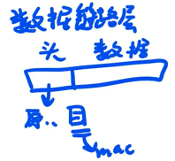
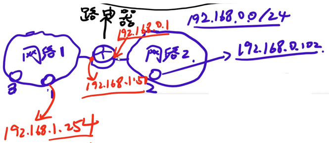

- [半小时看懂\<计算机网络\>](#半小时看懂计算机网络)
  - [物理层](#物理层)
  - [数据链路层](#数据链路层)
  - [网络层](#网络层)

---

参考

- [半小时看懂<计算机网络>](https://www.bilibili.com/video/BV124411k7uV/?spm_id_from=333.880.my_history.page.click&vd_source=454e9c56dd1d2d25131e921b939a8d39)

# 半小时看懂<计算机网络>

## 物理层

1. 转发
2. 标识

## 数据链路层

“交换机” 局域网内工作高效，完美替代 “集线器”

1. 记录 “Mac 地址” - “端口” 的映射
2. 双全工

方便桥接

## 网络层

“交换机” 满足了小规模局域网互联互通，跨局域网的互联由 “路由器” 解决

引入 IP 地址

- 标识网络
- 标识设备

此方法引入的待解决问题

1. 路由表的建立
2. 网络内的传输

对 `2.` 问题的举例

- `1.51 -> 1.254` 的通信
  1. 广播得到 `1.254` 的 Mac（通过 ARP 协议）
  2. 数据链路层的传输

- `0.102 -> 1.254` 的通信
  - `0.102 -> 0.1`, Mac: `mac0.102 -> mac0.1`, IP: `0.102 -> 1.252`
  - `0.1 -> 1.51 `, Mac: `mac0.1 -> mac1.51`, IP: `不变           ` 
  - `1.51 ->1.254`, Mac: `mac1.51 -> mac1.254`, IP: `不变           ` 

数据包的样子

