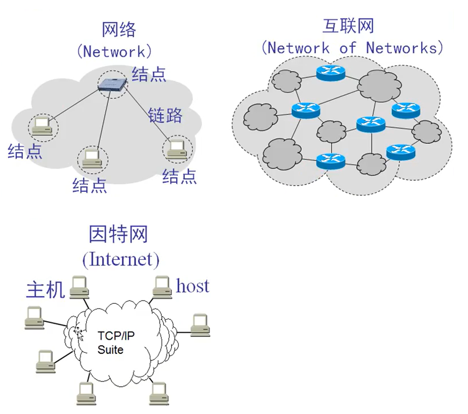
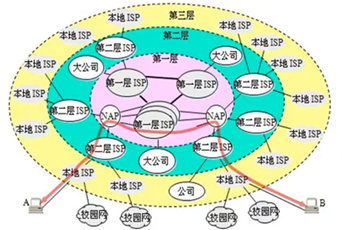
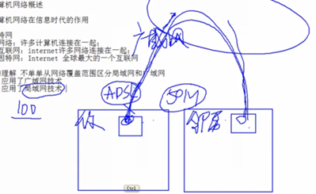
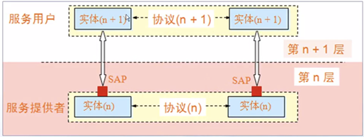
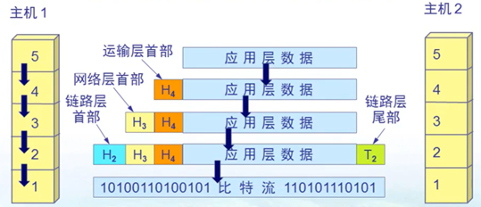

- [概述](#概述)
  - [Internet 的组成](#internet-的组成)
  - [多层次 ISP 结构的互联网](#多层次-isp-结构的互联网)
  - [计算机网络类别](#计算机网络类别)
  - [计算机网络的性能](#计算机网络的性能)
  - [计算机网络的体系结构](#计算机网络的体系结构)
  - [练习](#练习)

---

# 概述

## Internet 的组成

网络 (network)：许多计算机连接在一起

互联网 (internet)：许多 network 连接在一起

Internet：全球最大的一个 internet

## 多层次 ISP 结构的互联网

## 计算机网络类别

拓扑结构

- 总线型
- 环型
- 星型
- 树型
- 网状

交换方式

- 电路交换
- 报文交换
- 分组交换

作用范围

- 广域网 WAN
- 城域网 MAN
- 局域网 LAN
- 个人区域 PAN

广义上

- 广域网：应用的广域网技术
- 局域网：应用的局域网技术
- 例子如下
    

## 计算机网络的性能

1. 速率：单个数字信道的 b/s
2. 宽带：单个数字信道的 Max(b/s)
3. 吞吐量：全部数字信道的 b/s
4. 时延：发送、传播、排队、处理
5. 利用率
   - 信道利用率
   - 网络利用率：信道利用率的加权平均

$D=\displaystyle\frac{D_0}{1-U}$ 

- $D$ 网络当前时延
- $D_0$ 网络空闲时延
- $U$ 信道利用率

## 计算机网络的体系结构

5 层协议

- Application: 传输单元 PDU
- Transport: 报文
- Internet: 包
- Data Link: 数据帧
- Physical: 

## 练习

查看会话: `netstat` (Windows)