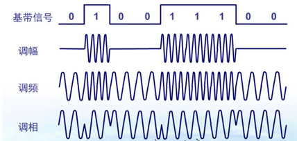

- [物理层](#物理层)
  - [通信方式](#通信方式)
  - [带通调制](#带通调制)

---

# 物理层

4 个特性

## 通信方式

根据信息在传输线上的传送方向，分为以下三种通信方式：

- 单工通信：单向传输
- 半双工通信：双向交替传输
- 全双工通信：双向同时传输

## 带通调制

“模拟信号” 是连续的信号，“数字信号” 是离散的信号

带通调制把 “数字信号” 转换为 “模拟信号”

