- [数据链路层](#数据链路层)
  - [三个基本问题](#三个基本问题)
      - [封装成帧](#封装成帧)
      - [透明传输](#透明传输)
      - [差错检验](#差错检验)
  - [点到点信道](#点到点信道)
  - [广播信道](#广播信道)
      - [碰撞](#碰撞)
      - [以太网帧格式](#以太网帧格式)
  - [MAC 地址](#mac-地址)
  - [交换机](#交换机)

---

# 数据链路层

链路 Link ：从一个节点到相邻节点的一段物理线路

数据链路 Data Link = 链路 + 协议

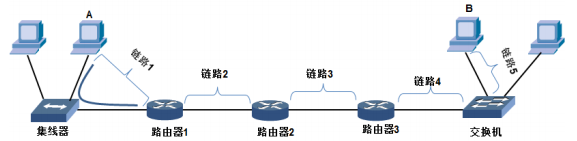

## 三个基本问题

#### 封装成帧

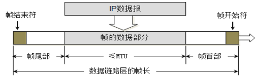

#### 透明传输

SOH (Start Of Header) ：帧开始定界符
EOT (End Of Transmission) ：帧结束定界符

如果传输的数据中出现了 SOH 和 EOT，要添加 ESC 加以区分

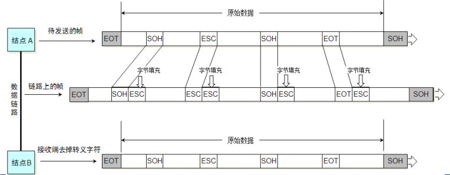

#### 差错检验

数据链路层广泛使用了循环冗余检验 CRC 的差错检验技术 (Cyclic Redundancy Check)

由 `帧的数据部分` 和 `数据链路层首部` 生成 `FCS`

1. 余数 `FCS` = `101001` % `p`
2. `101001FCS` % `p` == 0 则没有差错

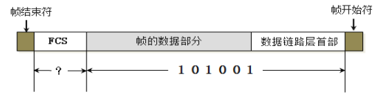

## 点到点信道

点到点信道：一条链路上只有一个发送端和接收端的信道，通常用 PPP 协议

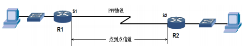

==PPP 协议三个组成==

- NCP : 用于支持不同网络层协议
- LCP : 协商一些选项
- HDLC : 将数据报封装到穿行链路，支持同步和异步
  - 如图 

==PPP 协议帧格式==

`Address: 0xff`，占 1 字节，形同虚设，实际上没有源地址和目标地址
`Control: 0x03`，占 1 字节
`Protocol`，占 2 个字节，不同的值用来标识 PPP 帧内信息是什么数据

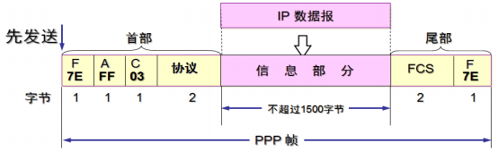

==PPP 协议填充方式==

异步传输

- 数据传输以 “字节” 为单位，PPP 帧的转义符定义为 `0x7D`，并使用字节填充
    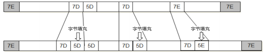

同步传输

- 数据传输以 “帧” 为单位，使用零比特填充
- `0x7E` 写成二进制 `01111110`
    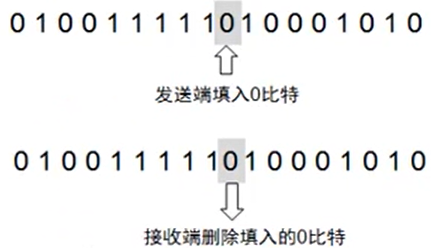

==GNS3==

抓包软件实际上不能抓到首尾的 `F` 和 `FCS`

改变路由器点到点通信的协议

- `show interfaces serial 2/0`
  - Serial2/0 is up, line protocol is up ( 前半句是物理层状态，后者是数据链路层 )
  - encapsulation [protocol]
- `config t`
- `interface serial 2/0`
- `encapsulation [protocol]`

## 广播信道

“广播信道” 使用 “带冲突检测” 的 “载波侦听” “多路访问” 机制通信 `CSMA/CD`

- 多路访问 ：说明这是总线型网络，许多主机以多点的方式连接到总线上
- 载波监听 ：每个主机都必须不停地监听信道。在发送前，如果监听到信道正在使用，就必须等待
- 碰撞检测 ：在发送中，如果监听到信道已有其它主机正在发送数据，就表示发生了碰撞。虽然每个主机在发送数据之前都已经监听到信道为空闲，但是由于电磁波的传播时延的存在，还是有可能会发生碰撞

使用 CSMA/CD 协议的网络就是 “以太网”，每个设备都有 MAC 地址

IEEE 802.3 给出了以太网的技术标准

#### 碰撞

传播时延的存在，还是有可能会发生碰撞

最先发送的站点最多经过 $2 \tau$ 就可以知道是否发生了碰撞，称 $2 \tau$ 为 “争用期”

以太网把争用期定为 $51.2μs$，对于 $10Mb/s$ 以太网，在争用期内可发送 $64B$

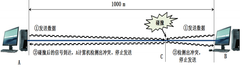

==退避算法==

当发生碰撞时，站点要停止发送，等待一段时间再发送

这个时间采用 “截断二进制指数退避算法” 来确定 `truncated binary exponential backoff`

- 从离散的整数集合 ${0, 1, .., (2k-1)}$ 中随机取出一个数，记作 $r$，然后取 $r$ 倍的 “争用期” 作为重传等待时间
- $k=Min\big[重传次数，10\big]$
- 
==以太网最短帧==

“最短帧” 防止冲突还没返回，该帧就发送完了

- 最短帧长度 = $2 \tau$ * 带宽 
- 记 “单程传播时延” 为 $\tau$    

#### 以太网帧格式

使用得最多的是 EthernetV2 标准

- 当 “数据” 长度小于 46，数据链路层在 “数据” 后加入一个整数字节的填充字段
- 对于检查出的无效 MAC 帧就简单地丢弃，以太网不负责重传丢弃的帧

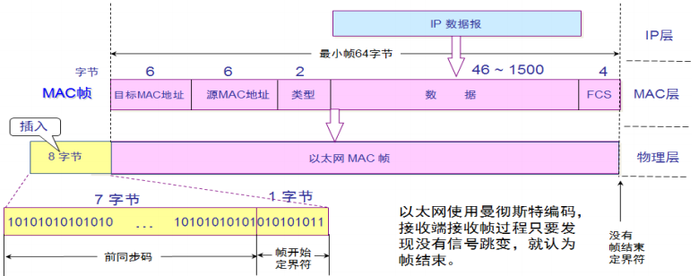

## MAC 地址

MAC 地址是链路层地址，长度为 6 字节（48 位），用于唯一标识网络适配器（网卡）

一台主机拥有多少个网络适配器就有多少个 MAC 地址

- 例如笔记本电脑普遍存在无线网络适配器和有线网络适配器，因此就有两个 MAC 地址

> 如何 “查看/更改” 自己网卡的 MAC 地址，扫描网络中的其他 MAC ？ 4-16

## 交换机

1. 端口独享带宽
2. 比集线器安全
3. 接口到计算机是全双工，不再使用 CSMA/CD 协议
4. 接口可以工作在不同的速率
5. 广播帧会转发到全部端口

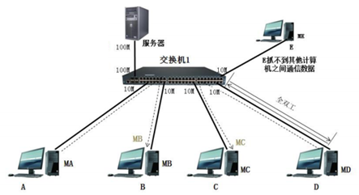

拓展：

- 广播风暴
- [生成树协议](./STP.md)

> 查看交换机 MAC 地址表 : 4-20
> 生成树协议 : 4-23/24