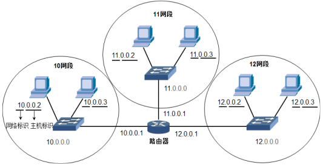
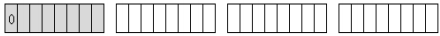
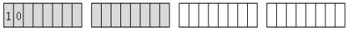
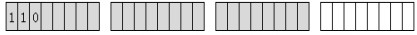
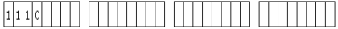

- [IP 地址和子网划分](#ip-地址和子网划分)
  - [IP 地址](#ip-地址)
      - [子网掩码](#子网掩码)
      - [分类](#分类)
      - [公网私网](#公网私网)
  - [子网划分](#子网划分)
  - [超网](#超网)

---

# IP 地址和子网划分

## IP 地址

- 32 bit
- 网络号 + 主机号

#### 子网掩码

使用子网掩码计算自己所在的网段

“IP 地址” 和 “子网掩码” 做 `&` 运算，得到网络号

子网掩码的一种表示方法 `CIDR`

- `10.0.0.0/8` 表示网络号为 8 位

#### 分类

- A `[1 ~ 126].0.0.0`
    
- B `[128 ~ 191].[0 ~ 255].0.0`
    
- C `[192 ~ 223].[0 ~ 255].[0 ~ 255].0`
    
- D 组播/多播地址，没有子网掩码
    

保留的 IP 地址

- 主机 ID 全 0 : 特指某个网段
- 主机 ID 全 1 : 广播地址
- `127.0.0.1` : 是本地环回地址，指本机地址，一般用来测试使用
- `169.254.0.0 ~ 169.254.255.255` : 实际上是自动私有 IP 地址
- `0.0.0.0` : 计算机的 IP 地址和网络中的其他计算机地址冲突，使用 `ipconfig` 命令看到的就是 `0.0.0.0`，子网掩码 `0.0.0.0`

#### 公网私网

私网地址访问 Internet 需要 NAT 或 PAT

保留的私网地址

- `10.0.0.0/8`
- `172.[16 ~ 31].0.0/16`
- `192.168.[0 ~ 255].0`

## 子网划分

作用：

- 避免公网地址浪费

步骤：

- 确定子网掩码的长度
- 确定子网中第一个可用的 IP 地址和最后一个可用的 IP 地址

## 超网

合并网段，类似子网划分的逆操作

判断一个网段是超网还是子网

1. 第一个 8 bit 属于什么类
2. 子网掩码多了还是少了