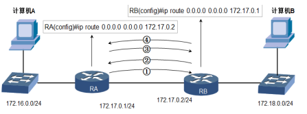
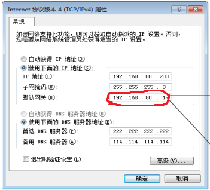
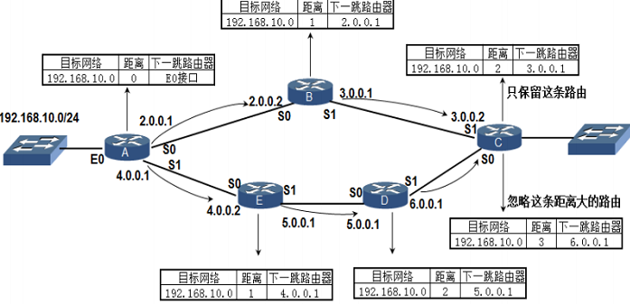
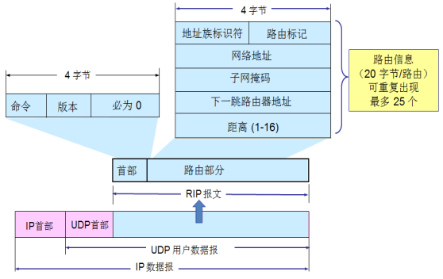

- [动态路由和静态路由](#动态路由和静态路由)
  - [网络层功能](#网络层功能)
  - [路由](#路由)
      - [静态路由](#静态路由)
      - [动态路由 RIP](#动态路由-rip)
      - [动态路由 OSPF](#动态路由-ospf)

---

# 动态路由和静态路由

## 网络层功能

功能

- 负责数据包选择转发的路径
- 不负责可靠传输
- 不负责按顺序到达

网络畅通条件

- 数据包有去有回

## 路由

对于路由器来说，它只知道自己直连的网段，对于没有直连的网段

- 管理员人工添加转发规则到路由表，就是静态路由
- 使用动态路由协议自动构建路由表，就是动态路由（ RIP OSPF ）

#### 静态路由

==GNS3==

静态路由的配置

- `show ip route`
- `configure t`
- `ip route [dest] [mask] [下一跳]` ( `[下一跳]`：地址或端口号 )
- `no ip route [dest] [mask]`

> 配置静态路由：6-4/5

==路由汇总==

类似 “超网” 的操作

```
子网掩码长的覆盖短的
这样设置 router 就会单独处理 172.16.10.0 这个特殊情况

R1(config)#ip route 172.16.0.0  255.255.0.0   10.0.0.2
R1(config)#ip route 172.16.10.0 255.255.255.0 10.0.1.2
```

==默认路由==

```
R1(config)#ip route 0.0.0.0 0.0.0.0 Rx
```

应用场景

- 指向 Internet
- 指向大多数网段

默认路由造成的往复转发
- 假设 “计算机 A” `ping 10.0.0.1`
- 那么这个数据包永远在 RA RB 之间来回传递
    

==Windows 上的路由表==

```
route print     // 显示 Windows 上的路由表

route add 0.0.0.0 mask 0.0.0.0 [下一跳] -p // 添加永久默认路由，等价于下图的设置
```



#### 动态路由 RIP

Routing Information Protocol

- 距离矢量路由选择协议
- 30 广播一次路由信息
- 选择路径的标准：跳数，不考虑带宽等指标
- 最大跳数 16
- 适合小规模网络
- 有两个 RIP 的版本
  1. 不带子网掩码信息
  2. 带子网掩码信息 



> 实验：6-16

==格式 RIPv2==

路由部分 = “路由信息” 的数组



==GNS3==

配置 RIP 协议

```
config t
router rip

network [addr]      // 接口直连的网络段 // 好像不支持 ABC 类之外的子网掩码
no network [addr]
version 2

debug ip rip
undebug all
show ip route
show ip route rip
show ip protocols   // 该路由器上的所有协议
```

#### 动态路由 OSPF

==关键字==

- Router-ID
  - 路由器的唯一标识，绝对不可以重复
- COST
- Link
  - 运行在 OSPF 进程下的接口
- Link-State
  - 例如接口上的 `IP 地址，子网掩码，网络类型，Cost` 等等
- Neighbor
  - 只有邻接状态才会交换 LSA

==协议工作过程==

1. 生成邻居表
2. 建立拓扑表：交换 LSA
3. 计算最短路径

==5 种报文==

- Hello
- Database Description : 链路状态的摘要信息
- Link State Request，LSR : 请求某些链路状态的完整信息
- Link State Update，LSU : 用洪泛法对全网更新链路状态
- Link State Acknowledgement，LSAck : 在 OSPF 中，只有 LSU 需要显式确认

==多区域==

网络分成多个区域，某区域中的路由信息变化后，只该区域的算法重新生成

==配置 GNS3==

```
config t
router ospf 1
network [直连网段] [反转子网掩码] area 0

show ip route ospf
show ip ospf neighbor
show ip ospf neighbor 
show ip ospf database
show ip ospf database router

debug ip ospf events
```
> 6-25