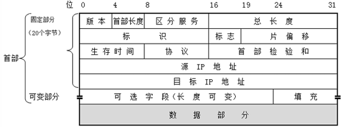
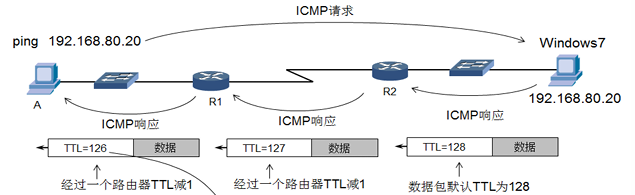
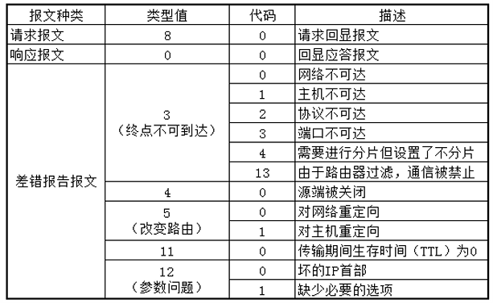
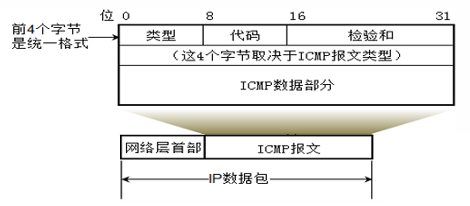
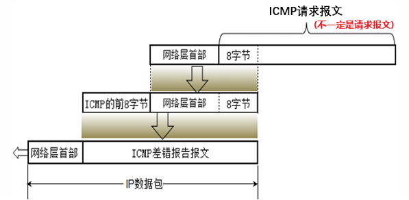
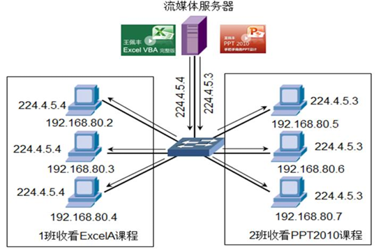
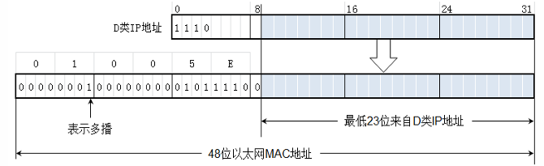
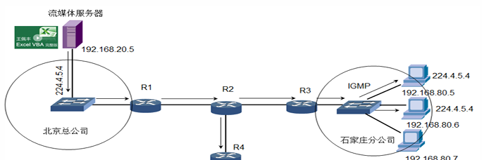

- [网络层协议](#网络层协议)
  - [网络层首部](#网络层首部)
  - [ICMP](#icmp)
      - [类型](#类型)
      - [格式](#格式)
      - [使用 ICMP 排除网络故障](#使用-icmp-排除网络故障)
  - [ARP](#arp)
  - [IGMP](#igmp)
      - [组播 Multicast](#组播-multicast)
      - [功能](#功能)
      - [实战](#实战)

---

# 网络层协议

## 网络层首部

==格式==



- 版本 : IP 协议目前有两个版本 IPv4 和 IPv6
- 首部长度 : `4 * n` 表示首部的长度，单位 Byte
- 区分服务 QoS : 路由器转发优先级（ 由主机加上标记，需要路由器能识别 ）
- 总长度 : “IP 首部” 和 “数据” 之和
- 标识 identification : 数据包分片，这些片的标识都一样
- 标志 flag 
  - 最低位记为 MF ( More Fragment )
    - MF=1 还有分片 
    - MF=0 最后一个
  - 中间的一位记为 DF ( Don’t Fragment )
    - 当 DF=0 时才允许分片
- 片偏移 : 某片在原分组中的相对位置，片偏移以 8 个字节为偏移单位
- 生存时间 TTL : 跳数限制
  - `ping -i` 初始化 TTL 的值，找到网络中的路由器
- 协议 : 指出此数据包携带的数据是使用何种协议



==GNS3==

```
配置链路 MTU

R1(config)    # interface serial 1/0
R1(config-if) # mtu 500
R1            # show interfaces serial 1/0
```

## ICMP

Internet Control Message Protocol

用于在 IP主机、路由器之间传递 “控制消息” 

“控制消息” 是指网络通不通、主机是否可达、路由是否可用等网络本身的消息

#### 类型

- ICMP 请求报文
- ICMP 响应报文
- ICMP 差错报告报文



#### 格式

报文的统一格式



差错报文

- `ICMP 的前 8 字节` 标识差错报告的类型
- `网络层首部 + 8 字节` 标识是哪个(请求)报文失败了



#### 使用 ICMP 排除网络故障

- `ping`
- `tracert`
  - `ping -i TTL`
- `pathping`
  - 原理和 `tracert` 一样

## ARP

Address Resolution Protocol

发送 ARP 广播帧将以太网中的计算机的 IP 地址解析成 MAC 地址

ARP 欺骗：告诉源计算机一个错误的 MAC 地址

==GNS3==

```
// windows
arp -a          // 主机缓存的 MAC 地址
arp -s          // static 绑定 MAC 地址 ( 不过重启电脑会清空 )

// GNS3
R1        # show arp            // 接口缓存的 MAC 地址
R1(config)# arp [IP] [MAC] arpa
```

## IGMP

Internet Group Management Protocol

#### 组播 Multicast

流媒体服务器就像电视台，组播地址相当于不同的频道

可以使用两个组播地址向网络中发送两个课程的视频，网络的中的计算机绑定哪个组播地址就能收到哪个视频课程



- IP 地址
  - 范围是 `224.0.0.0` 到 `239.255.255.255`
  - 其中有些是保留地址
  - 只能用于目的地址，而不能用于源地址
- MAC 组成如下图
  - 范围 `01005E-000000` 到 `01005E-7FFFFF`
  - 不同的组播 IP 地址可能构造出相同的多播 MAC 地址
  - 

#### 功能

1. 主机通过 IGMP 通知路由器希望接收或离开某个特定组播组的信息
2. 路由器通过 IGMP 周期性地查询局域网内的组播组成员是否处于活动状态，实现所连网段组成员关系的收集与维护



#### 实战

配置跨网段组播

感觉讲的不是很清楚

> 7-26