- [传输层](#传输层)
  - [UDP](#udp)
  - [TCP](#tcp)
      - [首部](#首部)
      - [可靠传输](#可靠传输)
      - [流量控制](#流量控制)
      - [拥塞控制](#拥塞控制)
      - [连接管理](#连接管理)
  - [传输层协议和应用层协议之间的关系](#传输层协议和应用层协议之间的关系)

---

# 传输层

场景

- 要发送的内容多，需要将发送的内容分成多个数据包发送
- 要发送的内容少，一个数据包就能发送全部内容

协议

- `TCP` Transmission Control Protocol
- `UDP` User Datagram Protocol

## UDP

要传输的内容一个数据包就全部发送，传输成功与否由应用层判断，节省服务器资源

- 实时语音，视频
- 组播

==首部==

- 首部字段只有 8 Byte，包括 `源端口、目的端口、长度、检验和`
- 12 Byte 的伪首部是为了计算 `检验和` 临时添加的，并不在网络中传输

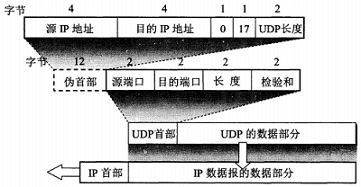

## TCP

要传输的内容需要分成多个数据包来传输 `分段，编号`

面向字节流 `流量控制` `拥塞避免`

客户端和服务器端需要建立 TCP 连接，通信结束释放连接 `可靠传输` `全双工通信`

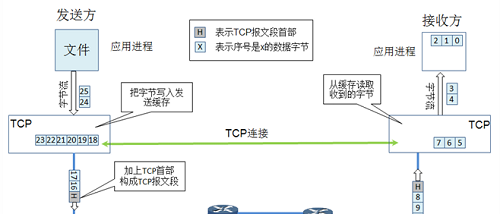

#### 首部

- 序号 ：该报文段第一个字节的编号
- 确认号 ：期望收到的下一个报文段的序号
- 数据偏移 ：首部长度，单位 4 Byte
- Urgent : `= 1` 高优先级，发送端不按排队顺序发送它
- Acknowledgment : `= 1` 确认号生效
- Push : `= 1` 高优先级，接收端不按排队顺序接收它
- Reset : `= 1` 表明 TCP 连接中出现严重差错，必须释放连接，再重新建立连接
- Synchronization : `= 1` 连接请求或连接接受，见三次握手
- Finish : `= 1` 表明数据发送完毕，并要求释放连接
- 窗口 ：窗口值作为接收方让发送方设置其发送窗口的依据，原因在于接收方的数据缓存空间是有限的
- 紧急指针 : `Urgent = 1` 时，用来指明 “紧急数据” 在报文中的位置

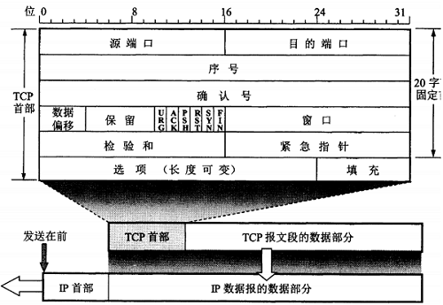

#### 可靠传输

==ARQ 协议==

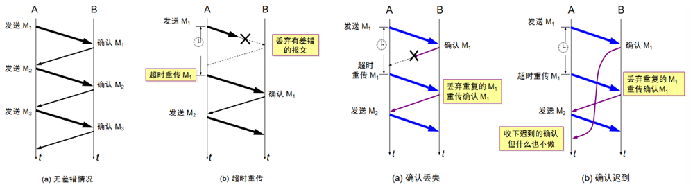

==连续 ARQ 协议和滑动窗口协议==

过程

- 在建立连接时由 “接收窗口” 决定了 “发送窗口”，之后受首部 “窗口” 的影响可以改变
- “确认号” 影响发送窗口的滑动
- 每个数据包在超时之前没收到对应的 “确认号”，就自动由发送方重发
- 
- 我相信 `8-17` 已经讲得很好了

优化

- SACK Selective Acknowledgment
  - 建立 TCP 连接时，首部的 “选项” 部分表明支持 SACK
  - 丢包时，接收方给出的报文首部如下
  - $ $
  - 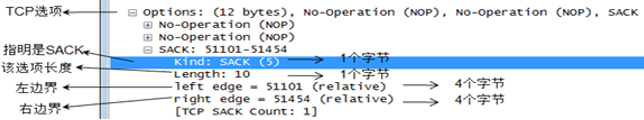
  - 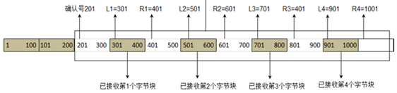
  - `left right` 的个数受到了首部最大长度的限制

==超时重传的时间==

一个报文段从 “发送” 到 “接收到确认” 所经过的时间称为 `往返时间 RTT`

由 `一套公式 + RTT` 共同决定了 `超时时间 RTO`

( 在传输过程中，会不停的进行的 RTT 采样，会随着网络畅通情况而改变 )

#### 流量控制

参与者：A，B 两台通信的主机

原因：接收方缓存区没位置了

“确认报文” 里面会有接收方的窗口更改信息，影响者发送窗口的大小 `rwnd`

#### 拥塞控制

参与者：整个网络的主机共同尽力

原因：信道带宽不够

方法：`慢开始 + 拥塞避免`

改进：`快重传 + 快恢复`

- 3 个重复的确认报文，催促发送方立刻重传，而不再等 RTO 了
- 
- 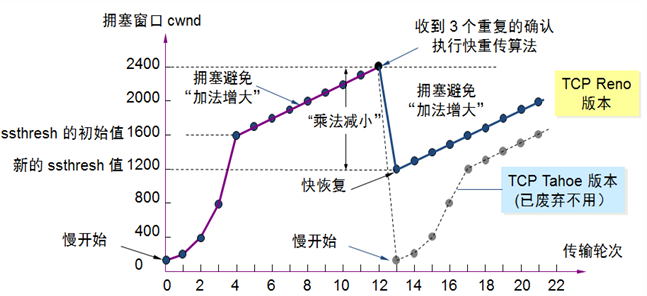

$\fcolorbox{red}{aqua}{综上，发送窗口 = Min(rwnd, cwnd)}$

#### 连接管理

创建：三次握手

- 原因：客户端发送的连接请求如果在网络中滞留，那么就会隔很长一段时间才能收到服务器端发回的连接确认。客户端等待一个超时重传时间之后，就会重新请求连接。但是这个滞留的连接请求最后还是会到达服务器，如果不进行三次握手，那么服务器就会打开两个连接。如果有第三次握手，客户端会忽略服务器之后发送的对滞留连接请求的连接确认，不进行第三次握手，因此就不会再次打开连接
- 
- 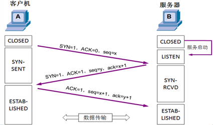
- 会话建立的状态 `netstat -n` 查看
- 
- “SYN 攻击” “LAND 攻击” 见 8-26

释放：四次挥手

- A 发送连接释放报文，`FIN = 1`
- B 收到之后发出确认，此时 TCP 属于半关闭状态，B 能向 A 发送数据但是 A 不能向 B 发送数据
- 当 B 不再需要连接时，发送连接释放报文，`FIN = 1`
- A 收到后发出确认，进入 TIME-WAIT 状态，等待 2 MSL（最大报文存活时间）后释放连接
- B 收到 A 的确认后释放连接
- 
- 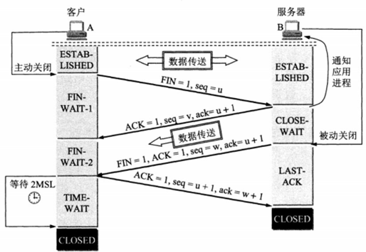
- 原因：见 [这里](https://github.com/CyC2018/CS-Notes/blob/master/notes/%E8%AE%A1%E7%AE%97%E6%9C%BA%E7%BD%91%E7%BB%9C%20-%20%E4%BC%A0%E8%BE%93%E5%B1%82.md#tcp-%E7%9A%84%E4%B8%89%E6%AC%A1%E6%8F%A1%E6%89%8B)

## 传输层协议和应用层协议之间的关系

`应用层协议 = 传输层协议 + 端口号`

- 常见的默认组合如下
  - 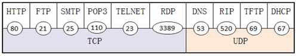

- 客机数据包中的 `IP 地址 + 传输层协议 + 端口号` 定位网络中某服务器提供的服务
  - 端口要求本地唯一
  - 来自客机的源端口是临时打开
  - $ $
  - 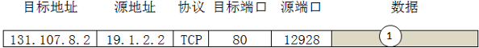
- 网络安全
  1. 防火墙限制端口流量只出不进
     - 依赖于 `Windows Firewall/Internet Connection Sharing` 服务
     - 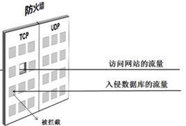
  2. TCP/IP 筛选
     - 安全级别更高，不依赖于其他服务 

```
// Windows 上的服务
//     为本系统提供的服务
//     为网络中其他计算机提供服务的服务

netstat -an             // 本地侦听的端口

telnet [ip] [port]      // 访问服务

或者用 “端口扫描工具”
```