- [应用层](#应用层)
  - [DNS](#dns)
      - [域名结构](#域名结构)
      - [解析过程](#解析过程)
      - [搭建内网的 DNS 服务](#搭建内网的-dns-服务)
      - [数据包格式](#数据包格式)
  - [DHCP](#dhcp)
      - [中继代理](#中继代理)
  - [TELNET](#telnet)
  - [HTTP](#http)
      - [URL](#url)
      - [创建 Web 站点](#创建-web-站点)
      - [报文](#报文)
      - [Cookie](#cookie)
      - [Web 代理](#web-代理)
  - [FTP](#ftp)
  - [电子邮件协议](#电子邮件协议)

---

# 应用层

## DNS

Donmain Name System

将域名解析成 IP 地址

#### 域名结构

==构成==

Fully Qualified Domain Name  `FQDN = hostname.domain`

例如 

```
www.kaiyuan.com
blog.kaiyuan.com

www blog 是 hostname
kaiyuan.com 是 domain
```

- 一个 hostname 可能放在多个服务器，即一个 FQDN 对应多个 IP 地址，实现负载均衡
- 一个服务器可能有多个 hostname，即多个 FQDN 对应一个 IP 地址
- 
- 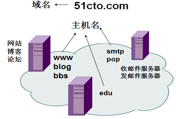

==层次==

- 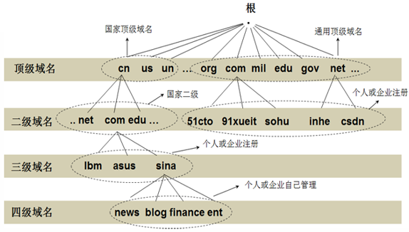
- 
- 只需注册 `sina.com.cn`，就可进行如下管理
- 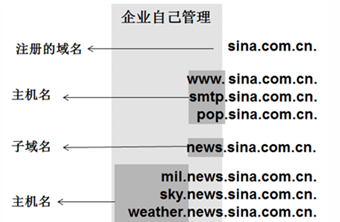

#### 解析过程

Windows `IPv4 DNS 服务器` 项表明了当前主机正在使用的 DNS 地址

详细的例子见视频  `9-5 06:37`

- 假设 client 用 B 的 DNS 服务
- 一个域名解析请求来到 B
  - 有记录直接返回
  - 否则访问根 `根提示`
    - 拿到根返回的信息又去访问 C E 之类的 DNS 服务
    - 像 FS 一样层层访问
- 结果返回给 B
- B 缓存结果，并把结果给 client
- client 缓存结果

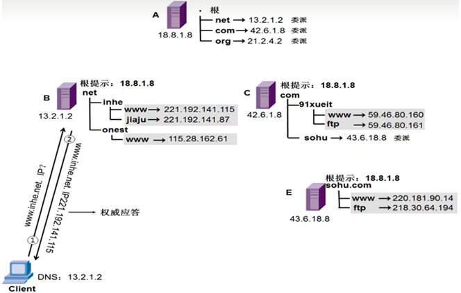

```bash
# 一些测试


# 下面的案例说明 DNS 解析成功

C:\Users> ping www.baidu.com

正在 Ping ... [IP adress] ...


# 查看/清除缓存

C:\Users> ipconfig /displaydns
C:\Users> ipconfig /flushdns


# 解析 FQDN

C:\Users> nslookup [FQDN]
C:\Users> nslookup
> set type=?
```

#### 搭建内网的 DNS 服务

就类似维护一个索引表，FQDN 和 IP 的列（ IP 可能指向对应 FQDN 本身，或者指向根）

- 设置根提示
- 正向查找
- 逆向查找

见视频 9-7/8/9

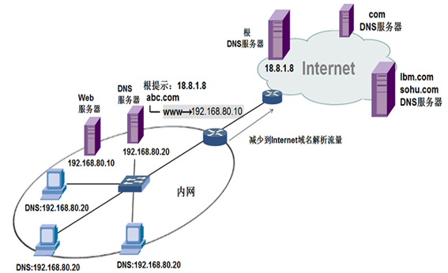

#### 数据包格式

```
# 是否迭代查询
# 客机的请求设 1，DNS 服务器对其他 DNS 服务器的请求设置为 0
Recursion desired

# 响应后返回的其他可用 DNS 服务器 IP
Authoritative nameservers 
Additional records
```

## DHCP

动态主机配置协议 DHCP Dynamic Host Configuration Protocol

提供了即插即用的连网方式，用户不再需要手动配置 IP 地址，子网掩码、网关 IP 地址等信息

> 静态地址使用场景：服务器静态地址，不怎么移动的台式机
> 
> 动态地址场景：移动设备，无线设备

DHCP 工作过程如下：

1. 客户端广播 Discover 报文，该报文的目的地址为 `255.255.255.255:67`，源地址为 `0.0.0.0:68`，被放入 UDP 中；如果客户端和 DHCP 服务器不在同一个子网，就需要使用中继代理
2. DHCP 服务器收到 Discover 报文之后，广播 Offer 报文给客户端，该报文包含了客户端所需要的信息；因为客户端可能收到多个 DHCP 服务器提供的信息，因此客户端需要进行选择
3. 如果客户端选择了某个 DHCP 服务器提供的信息，那么就广播 Request 报文给该 DHCP 服务器
4. DHCP 服务器广播 Ack 报文，表示客户端此时可以使用提供给它的信息

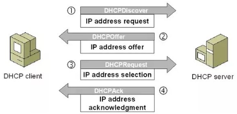

自动获得的 IP 地址有使用期限

- 期限用去 50% 找原来的 DHCP 服务器续约
- 期限用去 75% 找原来的 DHCP 服务器续约，如果没有续约成功，发广播请求地址
- 期限用去 100% 释放地址，生成 `169.254.0.0` 网段的一个地址 ( Windows )

- 重启计算机时，ping 网关
  - 通，看租约是否应该更新
  - 不通，请求新的地址
- 人工更新租约 `ipconfig /renew`
- 人工释放租约 `ipconfig /release`
- 查看租约信息 `ipconfig /all`

#### 中继代理

跨网段获得 DHCP 服务

- 如下 3 个网段
  - DHCP 在 2 网段，两个客机分别在 0/1 网段
  - 两个黑点是 0/1 网段的网关，需要额外的设置来支持把 DHCP 请求转发到 2 网段的 DHCP 服务器
    - `interface fastEthernet 0/0`
    - `ip helper-address [DHCP server IP]`
- 0 网段的客机申请 DHCP 服务的报文广播，网关收到
- 0 网段的网关转发给 `[DHCP server IP]`
- `[DHCP server IP]` 返回给 0 网段的网关
- 0 网段的网关又广播给客机
- 依次完成 Discover, Offer ... 的步骤

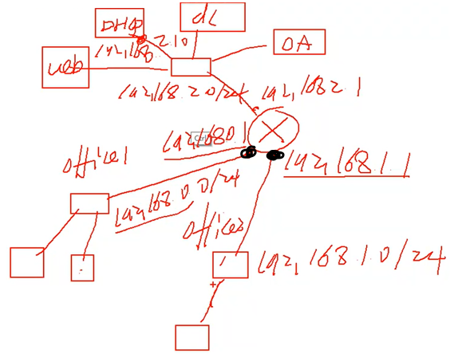

> 见视频 9-16

## TELNET

Telnet 是一个简单的远程终端协议，可以适应许多计算机和操作系统的差异，例如不同操作系统系统的换行符定义

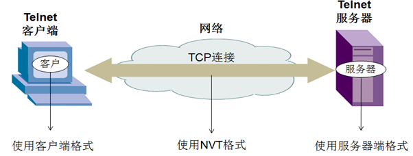

```
配置路由器启用 telnet

R2#               config t
R2(config)#       line vty 0 871          # 开虚拟端口
R2(config-line)#  password [***]          # 设置密码，才能远程登陆
R2(config-line)#  login
R2(config-line)#  exit
R2(config)#       enable password [***]   # 设置进入特权模式的密码
```

## HTTP

超文本传输协议 Hypertext Transfer Protocol

#### URL

统一资源定位符 Uniform Resoure Locator 

```
# URL 的一般形式

<protocol>://<FQDN>:<port>/<path>
```

#### 创建 Web 站点

在服务器上部署多个网站

- 服务器上整多个 IP 地址，一个网站使用一个地址
  - 浪费公网资源
- 或者一个网站占用一个端口，共用一个地址
  - 用户访问不友好
- 或者每个网站共用一个端口和一个地址，服务端设置 “主机头” 值来区分，用户用域名访问就行

#### 报文

- 请求报文-从客户端向服务器发送请求报文
  - GET POST HEAD PUT DELETE TRACE CONNECT OPTIONS
- 响应报文-从服务器到客户端的应答

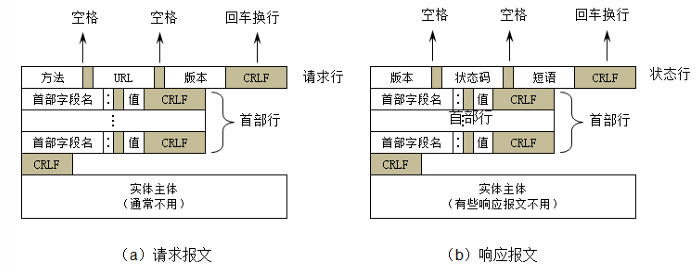

响应报文的状态码 Status-Code 都是三位数字的，分为 5 大类共 33 种

- 1xx 表示通知信息的，如请求收到了或正在进行处理
- 2xx 表示成功，如接受或知道了
- 3xx 表示重定向，如要完成请求还必须采取进一步的行动
- 4xx 表示客户端错误，如请求中有错误的语法或不能完成
- 5xx 表示服务器的差错，如服务器失效无法完成请求

#### Cookie

本地创建的一个文件用来缓存用户身份

#### Web 代理

“客机” 访问网站的请求指向 “代理”，“代理” 把请求转发给网站并获得返回数据，“代理”再把数据给 “客机”

- 控制内网对 Internet 的访问
- 绕过防火墙，比如梯子就是这个原理
- 节省带宽

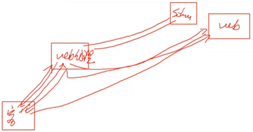

## FTP

文件传输协议 File Transfer Protocol

建立两个 TCP 连接

- 控制连接：服务器打开端口号 21 等待客户端的连接，客户端主动建立连接后，使用这个连接将客户端的命令传送给服务器，并传回服务器的应答
- 数据连接：用来传送一个文件数据

根据 “数据连接” 建立的方式分为主动和被动两种模式

- 主动模式要求客户端开放端口号给服务器端，需要去配置客户端的防火墙
- 被动模式只需要服务器端开放端口号即可，无需客户端配置防火墙，但是导致服务器端的安全性减弱，因为开放了过多的端口号

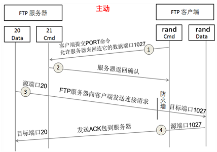

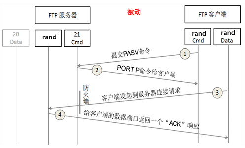

## 电子邮件协议

一个电子邮件系统由三部分组成：“用户代理”、“邮件服务器”、“邮件协议”

邮件协议包含发送协议和读取协议

- 发送协议常用 `SMTP`
- 读取协议常用 `POP3` `IMAP`

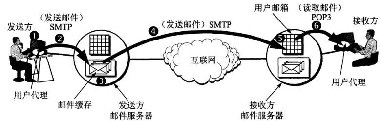

> 9-37/39 使用 telnet 发送邮件，部署内网邮件服务器
> 
> telnet 发送邮件使用的命令与数据包抓到的内容一致