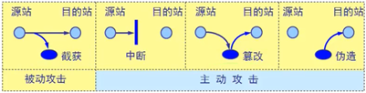
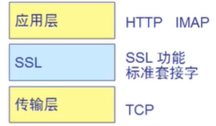
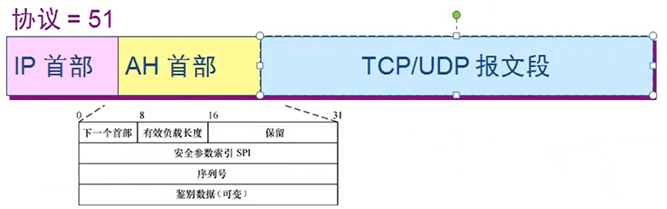
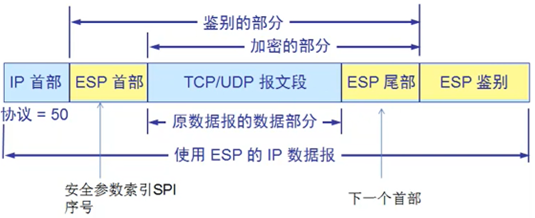
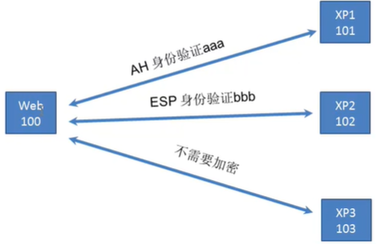

- [网络安全](#网络安全)
  - [概述](#概述)
      - [四个威胁](#四个威胁)
      - [恶意程序](#恶意程序)
  - [应用层安全](#应用层安全)
      - [数字签名](#数字签名)
  - [SSL](#ssl)
  - [网络层安全](#网络层安全)
      - [SA](#sa)
      - [AH](#ah)
      - [ESP](#esp)
      - [实验](#实验)
  - [数据链路层安全](#数据链路层安全)
  - [防火墙](#防火墙)

---

# 网络安全

## 概述

#### 四个威胁

1. 截获：从网络上窃听他人的通信内容（被动攻击）
2. 中断：有意中断他人在网络上的通信
3. 篡改：故意篡改网络上传送的报文
4. 伪造：伪造信息在网络上传送



#### 恶意程序

- 病毒
- 蠕虫
- 木马
  - `netstat -n` 查看是否有可疑会话
  - `msconfig` 查看是否有可疑服务被打开
- 逻辑炸弹

## 应用层安全

加密的思路为应用层提供安全

- 对称加密
  - 算法 + 密钥
  - 高效
- 非对称加密
  - 加密密钥和解密密钥不同：公钥，私钥
  - 安全

对称加密 “数据”，“公钥” 加密 “对称密钥”，再传给 “私钥”

#### 数字签名

- 证明身份
- 检查内容是否更改

```
# 检查内容是否更改

① 原文件 + 函数     -> 摘要 
② 摘要   + A 的私钥 -> A 的签名

B 收到 “原文件”，“函数”，“A 的签名”，“A 的公钥”，便可以核对文件是否被修改

    “A 的公钥” 解密 “A 的签名” 得到 “摘要 1”
    “原文件” 在 “函数” 的作用下 得到 “摘要 2”
    两者对比检查内容是否更改
```

```
# 证明身份

③ A 的公钥 + CA 私钥 -> 加密后的 A 的公钥


把上例中的 “A 的公钥” 替换为 “加密后的 A 的公钥”

    B 用 “CA 公钥” 解密 “加密后的 A 的公钥” 得到 “A 的公钥”
    如果 “原文件” 不是用 “A 的公钥” 加密，则不可能对比成功

公式 ③ 的另一个表达 $ A 的公钥和一些相关信息 + CA 私钥 -> 数字证书 $
```

参考：[数字签名是什么？](https://www.ruanyifeng.com/blog/2011/08/what_is_a_digital_signature.html)

## SSL

发送方：SSL 接收应用层的数据，对数据进行加密，然后把加了密的数据送往 TCP 套接字

接收方：SSL 从 TCP 套接字读取数据，解密后把数据交给应用层



在 Internet 上使用的安全协议

- `imaps tcp-993`
- `pop3s tcp-995`
- `smtps tcp-465`
- `https tcp-443`

## 网络层安全

#### SA

SA Security Association 是构成 IPSec 的基础

是两个通信实体经协商建立起来的一种协定（利用IKE协议），它决定了用来保护数据分组安全的安全协议 ( AH 或 ESP )、转码方式、密钥及密钥的有效存在时间等

- AH: 完整性
- ESP: 完整性且加密

#### AH

使用 AH 时

- AH 首部插在原数据报数据部分的前面
- IP 首部中的协议字段置为 51

在传输过程中，中间的路由器都不查看 AH 首部，当数据报到达终点时，目的主
机才处理 AH 字段，以鉴别源点和检查数据报的完整性



#### ESP 

使用 ESP 时

- IP 数据报首部的协议字段置为 50
- IP 首部后面紧接着的是 ESP 首部
- IP 数据报后面增加了 ESP 尾部和 ESP 鉴别



#### 实验



> 10-16/17

## 数据链路层安全

## 防火墙