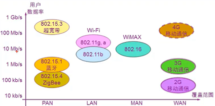
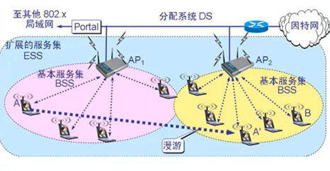

- [无线网络](#无线网络)
  - [无线局域网](#无线局域网)
  - [无线路由器](#无线路由器)
- [IPv6](#ipv6)

---

# 无线网络

## 无线局域网

AP : access point

安装 AP 时，必须为该 AP 分配一个不超过 32 字节的服务集标识符 SSID 和一个信道

设备开热点就是让设备本身充当一个 AP 的作用 (我猜)

## 无线路由器

从左到右依次可抽象为：`AP` `交换机` `路由器`

# IPv6

==特点==

- 扩展的地址空间和结构化的路由层次
  - 地址长度由 IPv4 的 32 位扩展到 128 位
  - 全局单点地址采用支持无分类域间路由的地址聚类机制，并且使自动配置地址更加简单
- 简化了报头格式
  - IPv6 的基本报头只是 IPv4 报头长度的两倍
  - 取消了对报头中可选项长度的严格限制，增加了灵活性
- 简单的管理
  - 概括起来就是即插即用
  - 通过实现一系列的自动发现和自动配置功能，简化网络节点的管理和维护
- 安全性
  - 在制定 IPv6 技术规范的同时，产生了 IPSec 用于提供 IP 层的安全性
- QoS 能力
- Anycast

==网络层变化==

- IPv6 取代 IPv4
- ICMPv6 取代 ICMP
- ND 取代 ARP
- MLD 取代 IGMP

==格式==

8 段，每段 16 bit