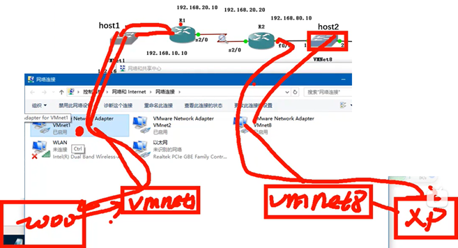

- [环境搭配](#环境搭配)
  - [抓包工具](#抓包工具)
  - [GNS3](#gns3)
      - [连通设备](#连通设备)
      - [虚拟机的通信](#虚拟机的通信)
  - [PacketTracer](#packettracer)

---

# 环境搭配

## 抓包工具

- 安装抓包工具 [Wireshrak](https://www.wireshark.org/)
- 管理捕获过滤器

## GNS3

- [GNS3 download](https://sourceforge.net/projects/gns-3/)
- [Cisco-img](https://doc.lagout.org/network/Cisco/IOS%20Collection/c3640/)

#### 连通设备

==VPCS==

- `ip [addr] [addr] [addr]`
- `save`
- `show`

==路由器==

三个模式 `()` `(config)` `(config-if)`

1. 以太网接口
   - `configure terminal`
   - `interface fastEthernet 0/0`
   - `ip address [addr] [addr]`
   - `(no) shutdown`
   - `exit`

2. 广域网接口
   - `show controllers serial 2/0`
   - `interface serial 2/0`
   - `clock rate ?`
   - `clock rate [number]`
   - `ip adress [addr] [addr]`
   - `copy running-config startup-config`

#### 虚拟机的通信

1. 虚拟机所在交换机跟物理网卡相连 （ “虚拟网络编辑” 中设置 ）
   - 关闭防火墙 `wf.msc`

2. GNS3 中 host (也是交换机) 跟物理网卡相连

==路由器下一跳==

- `show ip route`
- `config t`
- `ip route [addr] [addr] [addr]`

## PacketTracer

GNS3 的 se