<!-- @import "[TOC]" {cmd="toc" depthFrom=1 depthTo=6 orderedList=false} -->

<!-- code_chunk_output -->

- [STP](#stp)
  - [冗余链路中存在的问题](#冗余链路中存在的问题)
      - [大量的流量](#大量的流量)
      - [MAC 地址表不稳定](#mac-地址表不稳定)
      - [重复帧拷贝](#重复帧拷贝)
  - [STP 介绍](#stp-介绍)
      - [根交换机选举](#根交换机选举)
      - [端口花费和路径花费](#端口花费和路径花费)
      - [BPDU 帧的结构](#bpdu-帧的结构)
      - [STP 端口角色](#stp-端口角色)
      - [端口状态和 BPDU 时间](#端口状态和-bpdu-时间)
  - [STP 收敛](#stp-收敛)
      - [生成树的选举](#生成树的选举)
      - [STP 拓扑变化](#stp-拓扑变化)
  - [STP 负载均衡实验](#stp-负载均衡实验)

<!-- /code_chunk_output -->


---

参考

- [STP 生成树协议实例详解](https://www.qingsword.com/qing/636.html#CCNA-STP-7)

# STP

Spanning-Tree Protocol，生成树协议

在分层网络中存在 “冗余链路” 的情况，使用 STP 能够动态的管理这些 “冗余链路”

- 去环：不会产生流量环路
- 备份：当某台交换机的一条连接丢失时，另一条链路能迅速取代失败链路

## 冗余链路中存在的问题

如下图：SW1 和 SW2 之间有两条线路相连

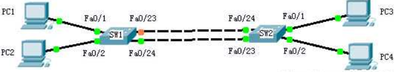

#### 大量的流量

广播风暴会产生大量的流量

1. PC1 发出一个广播帧，SW1 收到这个广播帧，SW1 将这个广播帧从除接收端口的其他端口转发出去（即发往fa0/2、fa0/23、fa0/24）
2. SW2 从自己的 fa0/23 和 fa0/24 都会收到 SW1 发过来的相同的广播帧，SW2 再将这个广播帧从除接收端口外的所有其他接口发送出去（ SW2 将从 fa0/23 接收的广播帧发往其他三个端口 fa0/24、fa0/1、fa0/2，从 fa0/24 接收到的也会发往其他三个端口 fa0/23、fa0/1、fa0/2）
3. 这样这个广播帧又从 fa0/23 以及 fa0/24 传回了SW1，SW1 再用相同的方法传回 SW2，除非物理线路被破坏，否则 PC1-4 将不停的接收到广播帧，最终造成网络的拥塞甚至瘫痪

#### MAC 地址表不稳定

广播风暴会造成 MAC 地址表的不稳定

1. PC1 发出的广播帧到达 SW1，SW1 将根据源 MAC 进行学习，SW1 将 PC1 的 MAC 和对应端口 fa0/1 写入 MAC 缓存表中
2. SW1 将这个广播帧从除接收端口之外的其他端口转发出去，SW2 接收到两个来自 SW1 的广播（从fa0/23和fa0/24），假设 fa0/23 首先收到这个广播帧，SW2 根据源 MAC 进行学习，将 PC1 的 MAC 和接收端口 fa0/23 存入自己的 MAC 缓存表，但是这时候又从 fa0/24 收到了这个广播帧，SW1 将 PC1 的 MAC 和对应的 fa0/24 接口存入自己的 MAC 缓存表。
3. SW2 分别从自己的这两个接口再将这个广播帧发回给 SW1，这样 PC 1的 MAC 地址会不停的在两台交换机的 fa0/23 和 fa0/24 之间变动，MAC 地址缓存表也不断的被刷新，影响交换机的性能

#### 重复帧拷贝

广播风暴会造成重复的帧拷贝

1. 假设PC1发送一个单播帧给PC3，这个单播帧到达SW1，假设SW1上还没有PC3的MAC地址，根据交换机的原理，对未知单播帧进行泛洪转发，即发往除接收端口外的所有其他端口(fa0/2、fa0/23、fa0/24)
2. SW2分从自己的fa0/23和fa0/24接收到这个单播帧，SW3知道PC3连接在自己的fa0/1接口上，所以SW1将这两个单播帧都转发给PC3
3. PC1只发送了一个单播帧，PC3却收到了两个单播帧，这会给某些网络环境比如流量统计带来不精确计算等问题

## STP 介绍

STP 通过 “拥塞” 冗余路径上的一些端口，确保到达任何目标地址只有一条逻辑路径

STP 借用交换 BPDU 来阻止环路（Bridge Protocol Data Unit，桥接数据单元），BPDU 中包含 BID 用来识别是哪台计算机发出的 BPDU（Bridge ID，桥ID）

物理线路的一些端口被禁用以阻止环路的发生，如果正在使用的链路出现故障，STP 重新计算，部分被禁用的端口重新启用起到备份的效果

STP 使用 STA 来决定交换机上的哪些端口被堵塞用来阻止环路的发生（Spanning Tree Algorithm，生成树算法）

- STA 选择一台交换机作为根交换机，称作根桥（Root Bridge）
- 以该交换机作为参考点计算所有路径

#### 根交换机选举

拥有最小 BID 的交换机被选举成为根交换机，BID 由三部分组成

- `Priority`
- `MAC address`
- `Extend system ID` ( 可选 )

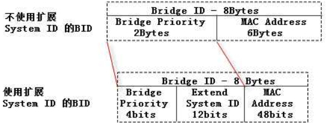

BID 一共 8 个字节

- 在不使用 `Extended System ID` 的情况下，针对每个 VLAN，`MAC address` 都不一样，`Priority` 属于 0~65535

- 在使用 `Extended System ID` 的情况下，每个 VLAN 的 `MAC address` 可以相同
  - 值得一提的是，现在的交换机普遍使用 `Extended System ID`

在同一个广播域中的所有交换机都参与选举根交换机

1. 当一台交换机启动时，它假设自己是根交换机，并默认每隔 2 秒发送一次 “次优 BPDU” 帧，帧中的 Root ID（根交换机的BID）和本机的 BID 相同

2. 在一个广播域中的交换机互相转发 BPDU 帧，并且从接收到的帧中读取 Root ID
   - 读取到的 Root ID 比本交换机的 BID 小，交换机更新 Root ID 为这个较小的 Root ID，然后继续转发修改后的 BPDU
   - 如果接收的 BPDU 中的 Root ID 比本交换机的 BID 大，那么继续将自己的 BID 作为 Root ID 向外发送 BPDU

3. 直到最后在同一个生成树实例中拥有一致的 Root ID，根交换机就被选出来了

下面用一个实例来演示一下根交换机的选举，在 `Cisco Packet Tracer 6.2` 中搭建出下面的拓扑

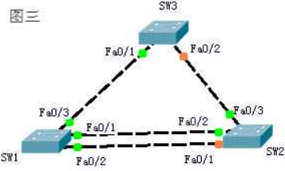

线连接好后等待几十秒钟，它们会自动选举出根交换机，使用下面的命令验证：

```
// SW1
// 在 SW1 上查看生成树信息，因为 SW1、SW2、SW3 上面都没有划分其他的 VLAN
// 所以默认只有 VLAN0001 的生成树信息
//
// "Spanning tree enabled protocol ieee"
// 表示交换机使用的生成树协议是 "PVST+"，这也是思科默认的生成树协议
//
// "Root ID" 后面是 VLAN1 中根交换机的 BID 参数
// Priority 32769       表示根交换机的优先级是 32769
// Address              是根交换机的 MAC 地址
// "This bridge is the root"，表示当前这台交换机就是根交换机
//
// "Hello Time  2sec  Max Age 20sec  Forward Delay 15sec"
// 表示 BPDU 发送间隔默认 2 秒，最大存在时间是 20 秒，转发延时是 15 秒
//
// "Bridge ID" 后面的参数是本交换机的 BID 参数
// 因为 SW1 就是根交换机，所以下面的参数和 "Root ID" 是一样的，
// 其中 "priority 32768 sys-id-ext 1"
// 表示 SW1 的优先级是 32768，Extended System ID 是 1，所以总优先级就是 32769
//
// SW1.BID = SW1.priority + SW1.MAC
//           32769 + 0001.9681.2683

SW1#show spanning-tree
VLAN0001
Spanning tree enabled protocol ieee
Root ID    Priority    32769
        Address     0001.9681.2683
        This bridge is the root
        Hello Time  2 ec  Max Age 20sec  Forward Delay 15sec

Bridge ID  Priority    32769  (priority 32768 sys-id-ext 1)
        Address     0001.9681.2683
        Hello Time  2sec  Max Age 20sec  Forward Delay 15sec
        Aging Time  20

Interface   Role Sts Cost      Prio.Nbr Type
----------- ---- --- --------- -------- ----------
Fa0/1       Desg FWD 19        128.1    P2p
Fa0/2       Desg FWD 19        128.2    P2p
Fa0/3       Desg FWD 19        128.3    P2p

----------------------------------------------------------------------------

// SW2
// 
// 可以看到 SW2 的 BID 中
//      SW2.priority == SW1.priority
//      SW2.MAC > SW1.MAC
// 
// 得到 SW2.BID > SW1.BID

SW2#show spanning-tree
VLAN0001
Spanning tree enabled protocol ieee
Root ID    Priority    32769
        Address     0001.9681.2683
        Cost        19
        Port        2(FastEthernet0/2)
        Hello Time  2sec  Max Age 20sec  Forward Delay 15sec

Bridge ID  Priority    32769  (priority 32768 sys-id-ext 1)
        Address     0030.A310.3975
        Hello Time  2sec  Max Age 20sec  Forward Delay 15sec
        Aging Time  20

----------------------------------------------------------------------------

// SW3
//
// 同理

SW3#show spanning-tree
VLAN0001
Spanning tree enabled protocol ieee
Root ID    Priority    32769
        Address     0001.9681.2683
        Cost        19
        Port        1(FastEthernet0/1)
        Hello Time  2sec  Max Age 20sec  Forward Delay 15sec

Bridge ID  Priority    32769  (priority 32768 sys-id-ext 1)
        Address     00E0.8F76.269C
        Hello Time  2sec  Max Age 20sec  Forward Delay 15sec
        Aging Time  20
```

上面这种情况是默认连线后不做任何修改根交换机的选举情况，可以通过下面的命令将某台交换机的优先级改小，或者设置成动态优先级（即永远比其它交换机的优先级小）

```
// 首先我随便配置一个优先级
// 它提示我，只能是 4096 的倍数，可以是下面的这些值

SW3(config)#spanning-tree vlan 1 priority 1000

% Bridge Priority must be in increments of 4096.
% Allowed values are:
0     4096  8192  12288 16384 20480 24576 28672
32768 36864 40960 45056 49152 53248 57344 61440

// 本例设置成 4096，注意设置针对的是 VLAN1
// 不同的 VLAN 优先级可以不同
// 不同 VLAN 的 STP 选举出来的根交换机也可以不同
// 比如 SW3 现在是 VLAN1 的根交换机
// 假设还存在一个 VLAN2，并且在 SW1 上使用这条命令
// 那么 SW1 就将成为 VLAN2 的根交换机，前提是 VLAN2 下有端口

SW3(config)#spanning-tree vlan 1 priority 4096
SW3(config)#end

// 过个一两秒，查看 SW3 的生成树信息，发现他已经成为了根交换机

SW3#show spanning-tree
VLAN0001
Spanning tree enabled protocol ieee
Root ID    Priority    4097
            Address     00E0.8F76.269C
            This bridge is the root
            Hello Time  2sec  Max Age 20sec  Forward Delay 15sec

Bridge ID  Priority    4097  (priority 4096 sys-id-ext 1)
            Address     00E0.8F76.269C
            Hello Time  2sec  Max Age 20sec  Forward Delay 15sec
            Aging Time  20             
```

使用下面的命令可以让交换机自动动态的调整自己的优先级为整个广播域最小

```
// 首先清除 SW3 上面手动配置的优先级
SW3(config)#no spanning-tree vlan 1 priority

// 在 SW2 上配置自动调整优先级，让 SW2 动态调整
SW2(config)#spanning-tree vlan 1 root primary

// 等待几秒钟，查看 SW2 的生成树信息,发现根交换机变成了自己
SW2#show spanning-tree
VLAN0001
    Spanning tree enabled protocol ieee
    Root ID    Priority    16385
                Address     0030.A310.3975
                This bridge is the root
```

#### 端口花费和路径花费

根交换机被选举出来后，计算其他交换机到根交换机的花费

STA 考虑两种花费，端口花费和路径花费

- 路径花费是从根交换机出发到最终交换机前进方向进入的端口花费总和
- 假设 SW1 是根交换机，想要改变 SW3 到根交换机 SW1 的花费，应该在 SW3 的 “端口” 来改变，而不是在 SW1 的 “端口” 上改变

如果一台交换机有多条路径到达根交换机，这台交换机会选择路径花费最小的那条，下面是默认的端口花费参照表：

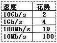

这个参照表只是端口默认的花费，端口花费是可以手动修改的

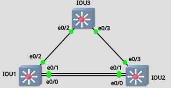

修改端口花费的实验使用 GNS3 来进行

IOU1-n 为 IOU 虚拟机中运行的交换机，其中 IOU1 被选举成为根交换机

```
// 可以看到 IOU3 到根交换机的花费是 100
// 这说明 IOU3 的 e0/2 接口速率是 10Mb/s

IOU3#show spanning-tree
VLAN0001
	Spanning tree enabled protocol ieee
	Root ID    Priority    32769
				Address     aabb.cc00.0100
				Cost        100
				Port        3 (Ethernet0/2)
```

尝试修改 IOU3 的 e0/2 接口到根交换机的花费

```
// 将 IOU3 的 e0/2 接口花费改成 300

IOU3(config)#int e0/2
IOU3(config-if)#spanning-tree cost 300
IOU3(config-if)#end

// 再次查看 IOU3 的生成树信息
// csot 200，port e0/3
// 原因
// 		1. `IOU3.e0/2 -> IOU1` cost 300
// 		2. `IOU3.e0/3 -> IOU2 -> IOU1` cost 200
// 这说明去往根交换机的数据是通过 IOU3 的 e0/3 发给 IOU2 再转发给 IOU1 的
// 即IOU3的e0/3的默认花费100，加上IOU2的e0/0的默认花费100
// 交换机选取花费最小的那条路径去往根交换机

IOU3#show spanning-tree
VLAN0001
	Spanning tree enabled protocol ieee
	Root ID    Priority    32769
				Address     aabb.cc00.0100
				Cost        200
				Port        4 (Ethernet0/3)
```

#### BPDU 帧的结构

BPDU 帧的结构简单的介绍一下：

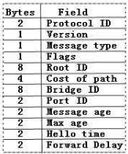

BPDU包含12个字段，如上图所示，部分字段解释如下：

Flags：标记域，包含 TC 比特位，TCA 比特位 

- Topology Change，拓扑改变
- Topology Change Acknowledgment,拓扑改变确认

Root ID：包含了根交换机的 BID
Cost of path：到根交换机的路径花费
Bridge ID：转发 BPDU 的交换机的 BID
Port ID：转发 BPDU 的交换机的 PID，PID 等于端口优先级 (默认128) 加端口号，后面会介绍到
Message age：BPDU 已经存在的时间
Max age：BPDU 最大存在时间
Hello time：根交换机发送配置信息的间隔时间，默认 2 秒
Forward Delay：转发延时，默认 15 秒

#### STP 端口角色

根端口 Root Port, RP 
 - 每个非根交换机上有且仅有一个根端口
 - 处于转发 Forwarding 状态

指派端口 Designated Port, DP
- 网络上除根端口外，所有允许转发流量的端口，每个网段都有一个指派端口
- 根交换机上的端口都是指派端口
- 处于转发 Forwarding 状态

非指派端口
- 既不是根端口也不是指派端口，这种端口虽然是激活的但是会被堵塞用来阻止环路
- 处于堵塞 Blocking 状态

禁用端口
- 被管理员使用 `shutdown` 命令关闭的端口称作禁用端口，禁用端口不参与生成树算法

#### 端口状态和 BPDU 时间

互连交换机通过在一个广播域交换 BPDU 帧构建一个逻辑上无环的路径

当一台交换机启动后，如果一个交换机端口直接转换到 Forwarding 状态可能会造成暂时性的环路

为了使用这个逻辑生成树，交换机需要在五种状态间转换，转换会历经三种 BPDU 时间

STP 中的五种端口状态：

1. Down（禁用）状态，可以使用 `no shutdown` 命令和插入网线来激活
2. Blocking（阻塞）状态，链路激活后转入阻塞状态，这个状态大约停留20秒，主要用来确定该端口的角色
   - 如果判断出该端口是非指派端口，则将保持在这一状态，即阻塞，如果处在阻塞状态的端口接收不到 BPDU 了，也会转入下一状态
   - 如果判断出是其他端口角色，则转入下一状态
3. Listening（侦听）状态，这个状态大约停留 15 秒，除了接收 BPDU 外，还向邻居发送BPDU，通知邻居它将参与激活拓扑
4. Learning（学习）状态，大约停留 15 秒，开始学习 MA C地址
5. Forwarding（转发）状态，端口可以转发数据帧

BPDU 的时间有三种：`Hello Time` `Max Age` `Forward Delay`

1. `Hello Time` 控制了发送配置 BPDU 的时间间隔，默认 2 秒，这是根交换机生成 BPDU 并向非根交换机发送的间隔
2. 非根交换机接收到根交换机发送来的 BPDU，再从除接收端口以外的其他端口转发出去，
   - 如果在 2-20 秒里面由于网络故障没有新的 BPDU 从根交换机发送过来，非根交换机将停止向外发送从根交换机接收到的 BPDU
   - 如果这种情况持续 20 秒，也就是 `Max Age`，非根交换机就使原储存的 BPDU 无效，并开始寻找新的根端口
   - 所谓 `Max Age` 就是非根交换机丢弃 BPDU 前用来备份储存它的时间
3. 转发延时是交换机在 Listening 状态到 Learning 状态所花的时间，默认是 15 秒

一台启动 STP 的交换机，每个端口从 UP 到 Forwarding 所需的时间大约是 50 秒左右，而普通的二层交换机端口 UP 到 Forwarding 瞬间就能完成

这会带来一个问题，那就是如果这台启动 STP 的交换机的接口连接的是一个终端设备，比如计算机，那么端口加电启动后计算机就要等上 50 秒才能发送数据，这很不合理

可以使用下面的命令将支持 STP 的交换机与终端相连的端口设置成快速端口，这样端口从 UP到 Forwarding 也能一瞬间完成了，但要注意，仅在连接计算机的端口上使用快速端口的功能，不要在和其他交换机，集线器网桥相连的端口上使用这个功能，否则很容易造成环路

```
// 假设这台交换机的 fa0/1 到 10 口都连接的是计算机

Switch(config)#int range fa 0/1 - 10
Switch(config-if-range)#spanning-tree portfast
```

## STP 收敛

STP 的收敛就是整个网络达到稳定的状态，选举出了根交换机，并决定出所有端口的角色，排除所有的潜在环路

#### 生成树的选举

这一小节是这篇文章最重要的部分，上面的所有理论都会在这一小节得到解释和应用，STP 最终收敛成为一个没有环路的网络需要满足下面四点：

- 每个广播域只能有一个根交换机
- 每个非根交换机有且只有一个根端口
- 每个网段有且只能有一个指派端口
- 既不是根端口也不是指派端口的端口会被阻塞

下面来看看生成树的选举过程，一共分为四步：

1. 选举根交换机
   - 交换机之间通过发送 BPDU 来选举根交换机，拥有最小 BID 的交换机将成为根交换机，每个广播域只能有一个根交换机

2. 选举根端口
   - 每个非根交换机有且只有一个根端口，选举根端口依照下面的顺序：
     - 首先，到根交换机的最低 cost 的端口将成为根端口
     - cost 相同的情况下比较 “发送者” 的 BID，BID 小的将成为根端口
     - BID 相同的情况下，比较 “发送者” 的 PID，PID 小的将成为根端口
     - 最后比较 “接收者” 的 PID，PID 小的将成为根端口
   - 举例，如图
	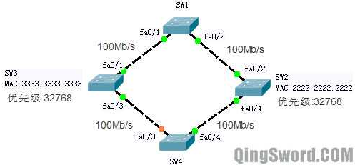
   - 图中 SW1 被选举成根交换机，交换机之间的链路都是 100Mb/s 
     - SW2 的根端口是 `SW2.fa0/2`
     - SW3 的根端口是 `SW3.fa0/1`
     - SW4 的根端口是 `SW4.fa0/4`
       - `(SW4.fa0/3.cost == SW4.fa0/4.cost) && (SW2.BID < SW3.BID)`
   - 比较 PID 时
		```
		// 这一部分信息就是 SW1 上面的端口信息，其中 Prio 下面的就是端口 ID
		// 可以看到 SW1 的 fa0/1 默认端口 ID 是 128.1，小于 fa0/2 的端口 ID

		SW1#show spanning-tree

		Interface Role Sts Cost  Prio.Nbr Type
		-------   ---- --- ----  ----     ----
		Fa0/1     Desg FWD 19    128.1    P2p
		Fa0/2     Desg FWD 19    128.2    P2p

		// 端口的优先级默认为 128，可以手动修改的，可以在 GNS3 中测试
		// 取值范围一般为 0~192 或 0~255

		SW2(config)#int fa 0/2
		SW2(config-if)#spanning-tree port-priority 100

		// 在 GNS3+IOU 环境中
		// 重新调整端口优先级后需要手动触发一次根交换机的选举才能让端口改变状态
		// 比如手动在根交换机上配置一个较小的优先级
		```

3. 选举指派端口
   - “每个网段” 有且只有一个指派端口（ “网段” 在这里指一条线路 ）
   - 其实，每个网段都有一个指派交换机，指派交换机上如果有多个端口，再从多个端口中选举出一个成为指派端口，指派端口的选举依照下面的顺序：
     - 比较到根交换机的 cost，小的是指派交换机
     - 再比较的 BID，小的是指派交换机
     - 再比较的 PID，小的是指派端口
   - 举例，如图
   	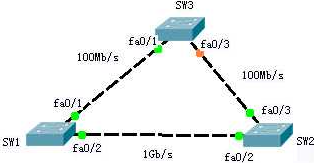
   - 上图中，SW1 是根交换机，因为每个网段都有一个指派端口，
     - 在 SW1 和 SW3 相连的线路上，由于 SW1 本身是根交换机，SW1 的 fa0/1 端口到自己的花费是 0，所以 SW1 的 fa0/1 接口被选举成指派端口（根交换机上的所有端口都是指派端口）
     - 同理在 SW1 和 SW2 相连的网段上，SW1 的 fa0/2 也被选举成了指派端口
     - 而在 SW2 和 SW3 相连的网段上，由于 SW1 和 SW2 之间是 1Gb/s 链路，SW2 去往根交换机的 cost 4 要小于 SW3 去往根交换的 cost 19，所以 SW2 是这个网段上的指派交换机，SW2 的 fa0/3 将成为这个网段的指派端口
     - 再根据前面的根端口的选举可以知道 SW2 的 fa0/2 是根端口，SW3 的 fa0/1 是根端口，SW3 的 fa0/3 端口因为不是根端口，也不是指派端口，所以被阻塞
   - 举例，如图
   	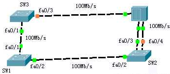
   - 上图中，SW1 是根交换机，SW2 和 SW3 相连的网段上有一台集线器，SW2 有两个端口连接在这台集线器上，这种情况下，如果 `SW2.BID < SW3.BID`，SW2 是指派交换机，但是 SW2 上面有多个端口连接在这个网段，这时就要比较这些端口的 PID
		```
		SW2#show spanning-tree
		VLAN0001

		...

		Interfac Role Sts Cost  Prio.Nbr Type
		-------- ---- --- ----  -------- ----
		Fa0/2    Root FWD 19    128.2    P2p
		Fa0/3    Desg FWD 19    128.3    Shr
		Fa0/4    Altn BLK 19    128.4    Shr

		// 可以看到的 fa0/3.PID < fa0/4.PID，所以 fa0/4 被阻塞，fa0/3 是指派端口
		```

4. 阻塞端口
   - 既不是根端口也不是指派端口的端口将被阻塞

#### STP 拓扑变化

当交换机检测到端口发生了变化时，交换机将通知根交换机拓扑变化情况，根交换机再将这一情况扩散到整个网络，有三种特殊的 BPDU 用来完成这些工作

- TCN BPDU ( Topology Change Notification )
- TCA BPDU（ Topology Change Acknowledgement ）
- TC BPDU（ Topology Change ）

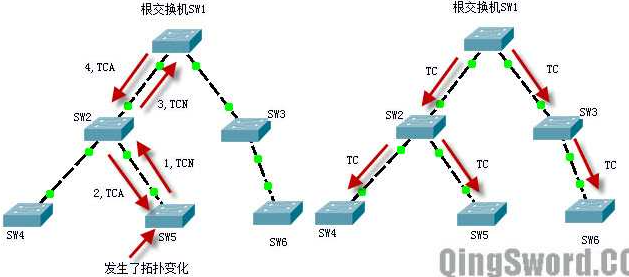

- SW5 首先检测到了拓扑变化，它从根端口向 SW2 发送 TCN，SW2 使用 TCA 向 SW5 确认
- SW2 产生一个 TCN 从自己的根端口发送给 SW1，也就是根交换机，根交换机 SW1 收到这个 TCN 后，使用 TCA 向 SW2 确认
- 一旦根交换机知道了这一拓扑变化，它将向外广播发送 TC 位被设置的 BPDU，就是上图右边的情况，最后整个广播域都知道了这一变化

## STP 负载均衡实验

实验在 GNS3+IOU 环境中完成

下图中 `IOUn` 是运行在 IOU 虚拟机中的两台交换机，接口连线如图所示：

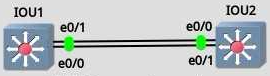

- IOU1 的 e0/0 连接了 IOU2 的 e0/1
- IOU1 的 e0/1 连接了 IOU2 的 e0/0
  
这两条链路被配置成主干，将 IOU1 设置成 VTP Server，IOU2 设置成 VTP Client，在 IOU1 上新建 VLAN2，让 IOU1 成为 VLAN1 的根交换机，IOU2 成为 VLAN2 的根交换机

在 VLAN1 生成树实例中 IOU2 的 e0/0 接口将被阻塞，VLAN1 的流量将全部从下面那条线路经过，而在 VLAN2 生成树实例中 IOU1 的 e0/0 将被阻塞，VLAN2 的流量将全部从上面这条线路走

```
// 首先将 IOU1 和 IOU2 相连的两条线路配置成主干

IOU1#conf t
IOU1(config)#int e0/0
IOU1(config-if)#swi mod tr
IOU1(config-if)#swi tr enc dot
IOU1(config-if)#swi tr all vl all
IOU1(config-if)#int e0/1
IOU1(config-if)#swi mod tr
IOU1(config-if)#swi tr enc dot
IOU1(config-if)#swi tr all vl all
IOU1(config-if)#exit

IOU2#conf t
IOU2(config)#int e0/0
IOU2(config-if)#swi mod tr
IOU2(config-if)#swi tr enc dot
IOU2(config-if)#swi tr all vl all
IOU2(config-if)#int e0/1
IOU2(config-if)#swi mod tr
IOU2(config-if)#swi tr enc dot
IOU2(config-if)#swi tr all vl all
IOU2(config-if)#exit

// 将 IOU1 配置成 VTP Server，IOU2 配置成 VTP Client

IOU1(config)#vtp mode server
IOU1(config)#vtp domain www.qingsword.com
IOU1(config)#vtp version 2
IOU1(config)#vtp pass 123456

IOU2(config)#vtp mod cl
IOU2(config)#vtp do www.qingsword.com
IOU2(config)#vtp pass 123456

// 在 VTP Server 上增加 Vlan2

IOU1(config)#vlan 2
IOU1(config-vlan)#name vlan2
IOU1(config-vlan)#exit

// 确保 IOU2 学习到了这个 Vlan2 后
// 将 IOU1 配置成 Vlan1 的根交换机，将 IOU2 配置成 Vlan2 的根交换机

IOU1(config)#spanning-tree vlan 1 root primary

IOU2(config)#spanning-tree vlan 2 root primary

// 根据前面介绍的 STP 收敛
// 可以分析出哪些端口会被阻塞
// 因为思科交换机默认使用的 STP 协议为 PVST+
// 这种协议为每一个 VLAN 生成一个生成树

// VLAN1 的生成树，在本实例中 IOU1 是 Vlan1 的根交换机
IOU1#show spanning-tree
VLAN0001
	Spanning tree enabled protocol ieee
	Root ID    Priority    24577
				Address     aabb.cc00.0100
				This bridge is the root
				Hello Time   2 sec  Max Age 20 sec  Forward Delay 15 sec

	Bridge ID  Priority    24577  (priority 24576 sys-id-ext 1)
				Address     aabb.cc00.0100
				Hello Time   2 sec  Max Age 20 sec  Forward Delay 15 sec
				Aging Time  300 sec

Interface  Role Sts Cost  Prio.Nbr Type
---------- ---- --- ----  -------- ----
Et0/0      Desg FWD 100   128.1    Shr
Et0/1      Desg FWD 100   128.2    Shr

// 这里是 VLAN2 的生成树，IOU2 是根交换机
VLAN0002
	Spanning tree enabled protocol ieee
	Root ID    Priority    24578
				Address     aabb.cc00.0200
				Cost        100
				Port        2 (Ethernet0/1)
				Hello Time   2 sec  Max Age 20 sec  Forward Delay 15 sec

	Bridge ID  Priority    32770  (priority 32768 sys-id-ext 2)
				Address     aabb.cc00.0100
				Hello Time   2 sec  Max Age 20 sec  Forward Delay 15 sec
				Aging Time  300 sec

// IOU1 的 e0/0 端口在 VLAN2 生成树实例中被阻塞
Interface  Role Sts Cost  Prio.Nbr Type
---------- ---- --- ----  -------- ----
Et0/0      Altn BLK 100   128.1    Shr
Et0/1      Root FWD 100   128.2    Shr
```

这样就实现了 VLAN 的负载均衡和冗余备份；线路没有故障前 VLAN1 的数据从下面的路径走，VLAN2 的数据从上面的路径走，当任意一条路径出现故障的时候，STP 重新收敛，剩下的那条线路将承担 VLAN1 和 VLAN2 的全部流量
